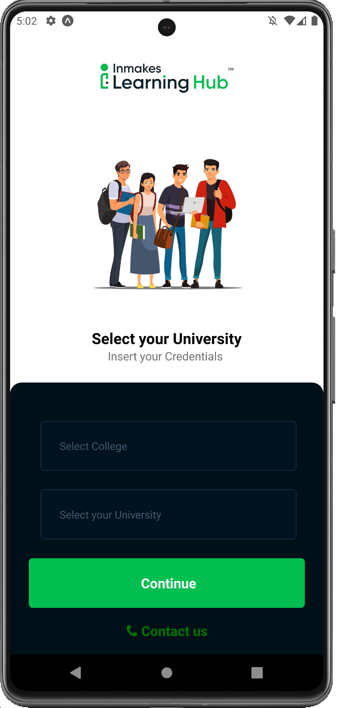
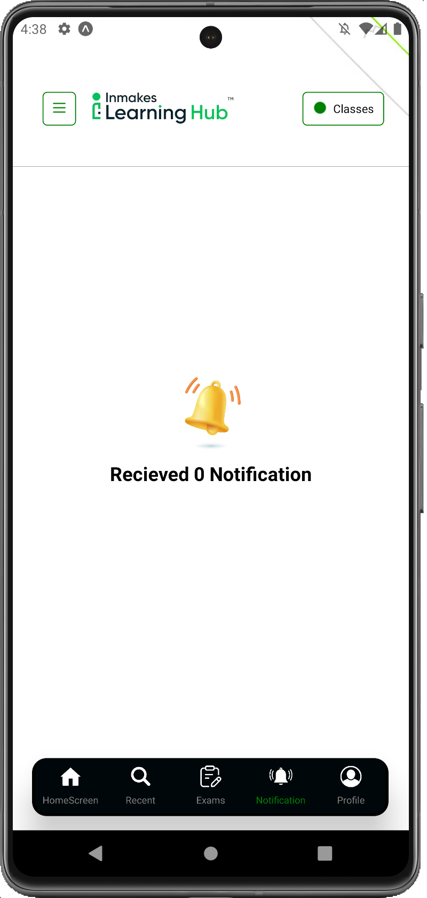
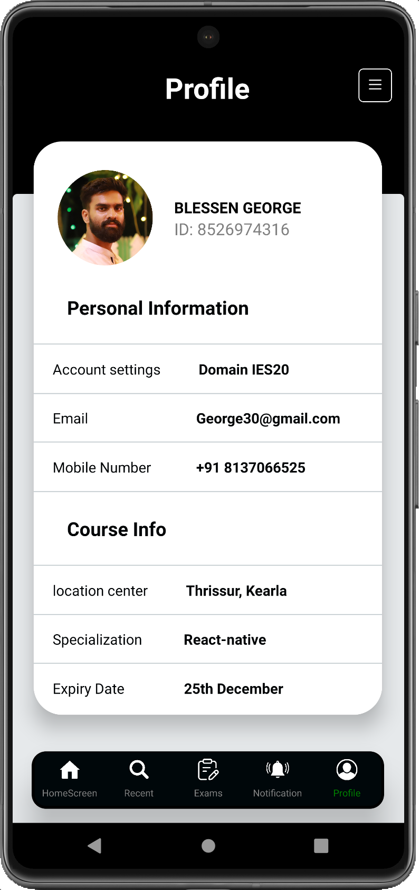

# LEARNING HUB APP

Welcome to LEARNING-HUB, your one-stop destination for online learning! Whether you're looking to enhance your skills, pursue a new hobby, or advance your career, LEARNING-HUB offers a vast library of courses taught by experts from around the world. With our app, learning has never been more convenient and accessible.


## FEATURES  🚀

Diverse Course Catalog:
Explore thousands of courses across various categories, from technology and business to health and fitness. Our extensive catalog ensures that there's something for everyone.🌟

On-the-Go Learning:
Seamlessly transition between devices and pick up where you left off. Whether you're commuting, waiting in line, or relaxing at home, your learning journey is always within reach. 📱

Interactive Learning:
Engage with course material through quizzes, projects, and discussions. Gain practical, hands-on experience to reinforce your understanding and apply your knowledge in real-world scenarios. 🚀

Lifetime Access:
Purchase a course once, and you'll have lifetime access to the content. Brush up on skills or revisit course material whenever you need a refresher. 🔄

Progress Tracking:
Monitor your progress with detailed insights and track your achievements as you complete each section. Stay motivated and celebrate your learning milestones. 🎉📈

Personalized Recommendations:
Receive course recommendations tailored to your interests and previous learning history. Discover new topics and expand your knowledge in areas you're passionate about. 🌐🎓

Download the Learning Hub app now and embark on your learning journey! Unlock your potential, acquire new skills, and take control of your personal and professional development. 🚀

Start learning today! 📚✨


## Screenshots










## Installation

Install my-project with npm

```bash
  npm install LEARNING-HUB
  cd LEARNING-HUB
```
```bash
  npx expo start
```
```bash
  npx run-android
```    
## 🚀 About Me

I'm a front-end Javascript developer...


# Hi, I'm Blessen George! 👋


👩‍💻 I'm currently working on React-native

🧠 I'm currently learning Fundamental concepts of Javascript

⚡️ Fun fact...

